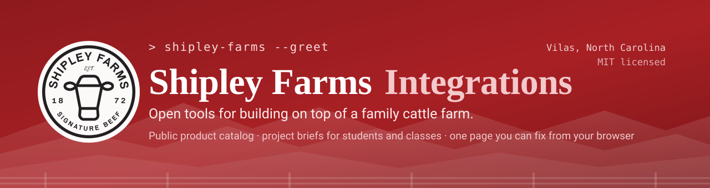

  

  <a href="docs/API.md"><b>API docs</b></a> &nbsp;·&nbsp;
  <a href="https://healthymeats.github.io/shipley-integrations/demo/"><b>Partner API demo</b></a> &nbsp;·&nbsp;
  <a href="docs/PROJECTS.md"><b>Project briefs</b></a> &nbsp;·&nbsp;
  <a href="docs/FOR-EDUCATORS.md"><b>For instructors</b></a> &nbsp;·&nbsp;
  <a href="docs/FOR-BUSINESSES.md"><b>For food businesses</b></a>

---

Open tools for building on top of [Shipley Farms](https://shipleyfarmsbeef.com/?utm_source=github&utm_medium=repo&utm_campaign=shipley-integrations&utm_content=readme), a family
cattle operation in Vilas, North Carolina.

## Resources

All public, all live, no key and no signup.

### Machine-readable

| Resource | What it is |
|---|---|
| [`/files/catalog.json`](https://shipleyfarmsbeef.com/files/catalog.json) | **The product catalog.** schema.org `ItemList`: SKU, name, category, description, image, retail price. Start here |
| [`/files/sitemap-products.xml`](https://shipleyfarmsbeef.com/files/sitemap-products.xml) | Every product page URL |
| [`/sitemap.xml`](https://shipleyfarmsbeef.com/sitemap.xml) | Every page on the site |
| [`/files/status.json`](https://shipleyfarmsbeef.com/files/status.json) | Service status, as data |
| [`/llms.txt`](https://shipleyfarmsbeef.com/llms.txt) | Site summary for AI assistants |
| [`/agents.md`](https://shipleyfarmsbeef.com/agents.md) | What we ask automated agents to do and not do |
| [`/robots.txt`](https://shipleyfarmsbeef.com/robots.txt) | Crawl rules. Please honour them |

### Pages worth knowing

| Page | What it is |
|---|---|
| [Partner API demo](https://healthymeats.github.io/shipley-integrations/demo/) | The ordering API we are designing, running in your browser on sample data |
| [/helloworld](https://shipleyfarmsbeef.com/helloworld?utm_source=github&utm_medium=repo&utm_campaign=shipley-integrations&utm_content=readme) | The front door. Fix one typo and you have contributed |
| [/directory](https://shipleyfarmsbeef.com/directory?utm_source=github&utm_medium=repo&utm_campaign=shipley-integrations&utm_content=readme) | Every page on the site, generated from the live route tables |
| [/contact-form](https://shipleyfarmsbeef.com/contact-form?utm_source=github&utm_medium=repo&utm_campaign=shipley-integrations&utm_content=readme) | Reach a person, no account needed |
| [/status](https://shipleyfarmsbeef.com/status?utm_source=github&utm_medium=repo&utm_campaign=shipley-integrations&utm_content=readme) | Is the store up |
| [/catalog](https://shipleyfarmsbeef.com/catalog?utm_source=github&utm_medium=repo&utm_campaign=shipley-integrations&utm_content=readme) | The catalog as a readable page |
| [/all-products](https://shipleyfarmsbeef.com/all-products?utm_source=github&utm_medium=repo&utm_campaign=shipley-integrations&utm_content=readme) | The storefront itself |
| [/wholesale](https://shipleyfarmsbeef.com/wholesale?utm_source=github&utm_medium=repo&utm_campaign=shipley-integrations&utm_content=readme) | How buying at wholesale works |
| [/wholesale-application](https://shipleyfarmsbeef.com/wholesale-application?utm_source=github&utm_medium=repo&utm_campaign=shipley-integrations&utm_content=readme) | Apply for a wholesale account |

### In this repository

| Document | Read it if |
|---|---|
| [`docs/API.md`](docs/API.md) | You are about to write code against our data |
| [`docs/PROJECTS.md`](docs/PROJECTS.md) | You want something worth building, with acceptance criteria |
| [`docs/FOR-BUSINESSES.md`](docs/FOR-BUSINESSES.md) | You sell food and want to carry our beef |
| [`docs/FOR-EDUCATORS.md`](docs/FOR-EDUCATORS.md) | You teach, and want a free class project |
| [`docs/HOW-IT-STAYS-SEPARATE.md`](docs/HOW-IT-STAYS-SEPARATE.md) | You need to know nothing here can reach our live systems |
| [`AGENTS.md`](AGENTS.md) | You are an AI agent, or pointing one at this |
| [`CONTRIBUTING.md`](CONTRIBUTING.md) | You are about to open a pull request |
| [`SECURITY.md`](SECURITY.md) | You found a security problem |
| [`docs/MEASUREMENT.md`](docs/MEASUREMENT.md) | You wonder why our links carry tracking parameters |

We run our storefront on ERPNext and we would rather build it with other people than alone.
This repository is for **your** code: connectors, clients, and tools that talk to our catalog.
What you contribute here stays yours, under your name, under the MIT license.

**You do not need access to our internal code to build anything in here.** Our store's own
source is private, because it holds live payment configuration. Everything in this repository
works against public, documented data instead.

## What this is today, and what it is not

Read this before you build anything.

| | Status |
|---|---|
| Read our full product list, with retail prices | **Works now.** One public file, no key |
| Display our products in your own site, menu or app | **Works now** |
| See wholesale pricing for your business | **Not available.** Pricing is per-account and never public |
| Check stock, pack sizes, lead times, minimums | **Not available yet** |
| Place an order, or check an order's status | **Not available yet.** There is no ordering endpoint |
| Authenticate as a partner | **Not available yet** |

So: you can build something that **shows** our beef. You cannot yet build something that
**buys** it. The authenticated partner API that would change that is in design, and we would
rather design it around a real business than guess. You can **[try the proposed design in your browser](https://healthymeats.github.io/shipley-integrations/demo/)** and tell us where it is wrong, and if you sell food for a living see [`docs/FOR-BUSINESSES.md`](docs/FOR-BUSINESSES.md).

One more thing worth knowing up front: the catalog file is a **periodic snapshot**, regenerated
by hand rather than live. Read `x_shipley_provenance.generated_at_utc` and treat the prices as
indicative, not as a quote.

## Start here

| If you want to... | Go to |
|---|---|
| Read our product catalog | [`docs/API.md`](docs/API.md) |
| See working code | [`examples/`](examples/) |
| Publish an integration | [`integrations/`](integrations/) and [`CONTRIBUTING.md`](CONTRIBUTING.md) |
| Make your first contribution | [`site/helloworld.html`](site/helloworld.html), live at [/helloworld](https://shipleyfarmsbeef.com/helloworld?utm_source=github&utm_medium=repo&utm_campaign=shipley-integrations&utm_content=readme) |
| Report a bug in our store | [Open an issue](../../issues/new/choose) |
| Report a security problem | [`SECURITY.md`](SECURITY.md), **not** a public issue |
| Find a project to build | [`docs/PROJECTS.md`](docs/PROJECTS.md) |
| Use this with a class | [`docs/FOR-EDUCATORS.md`](docs/FOR-EDUCATORS.md) |
| Check this cannot break the farm | [`docs/HOW-IT-STAYS-SEPARATE.md`](docs/HOW-IT-STAYS-SEPARATE.md) |
| Contribute as an AI agent | [`AGENTS.md`](AGENTS.md) |
| **See the partner API working** | **[Interactive demo](https://healthymeats.github.io/shipley-integrations/demo/)** |
| Connect your food business to us | [`docs/FOR-BUSINESSES.md`](docs/FOR-BUSINESSES.md) |
| Talk to us without GitHub | <https://shipleyfarmsbeef.com/helloworld?utm_source=github&utm_medium=repo&utm_campaign=shipley-integrations&utm_content=readme> |

## Never sent a pull request before?

Start at **<https://shipleyfarmsbeef.com/helloworld?utm_source=github&utm_medium=repo&utm_campaign=shipley-integrations&utm_content=readme>**. There is exactly one deliberate spelling
mistake on that page, and [the file behind it](site/helloworld.html) is in this repository. Fix
it, open a pull request, and when we merge it the live page changes. No install, no setup, about
ten minutes.

That page is a real page on a working farm's storefront, not a sandbox. See [`site/`](site/).

## Students, classes and interns

**Contributions here are citable.** A merged pull request is public and permanent, your name
goes in [`CONTRIBUTORS.md`](CONTRIBUTORS.md), and if someone asks us to confirm you contributed,
we will. See what we will and will not say about your work in that file.

Twenty project briefs at three difficulty levels, including analysis and design work for
security and IT courses, are in [`docs/PROJECTS.md`](docs/PROJECTS.md). Instructors, start at
[`docs/FOR-EDUCATORS.md`](docs/FOR-EDUCATORS.md).

Nothing you do here can reach our live systems, which is deliberate and is explained in
[`docs/HOW-IT-STAYS-SEPARATE.md`](docs/HOW-IT-STAYS-SEPARATE.md).

## What is open

Today there is one stable, public surface: a schema.org product feed at
**<https://shipleyfarmsbeef.com/files/catalog.json>**. Every product, with SKU, name, URL,
category, brand, description, image, and price. It is a static file, so reading it costs us
nothing and you can poll it as often as you like.

A scoped **partner API** for wholesale ordering (your prices, your orders, your invoices,
your tracking) is in design. If you supply restaurants, run one, or operate another store that
would buy from us, open an issue tagged `partner-api` and tell us what you need. We would
rather build it against a real integration than guess.

## What is not open, and why

- **Anyone else's data.** Customers, orders, contacts. Not now, not scoped, not aggregated.
- **Our margins, costs, and supplier terms.** We are a small operation competing with large
  ones. This is the one thing that would genuinely hurt us.
- **Anything touching payment processing.** Not because we are hiding it, but because there
  is no version of a community patch to a live card path that we could accept responsibly.

Everything else is a conversation. If you want something that is not listed, ask.

## Use the catalog file, not a crawler

`catalog.json` has everything the product pages have, in one request, already structured. It is
faster for you than scraping and it is the polite way to do this.

Automated scanning, load testing and bulk crawling are not welcome. If your project needs
something the catalog file does not cover, ask and we will find a way to give it to you
properly.

## License

MIT. See [`LICENSE`](LICENSE). Contributors keep their copyright and sign off with a DCO line
rather than assigning anything to us. See [`CONTRIBUTING.md`](CONTRIBUTING.md).

**Scope.** The MIT licence covers everything in this repository: the tools, the example client,
the demo, the documentation, and the page sources in [`site/`](site/). Nothing here is derived
from or links against Shipley Farms' own store software, which is separate, private, and not
under this licence. Our product names, photographs, and the Shipley Farms name and marks are
not licensed by this file.
